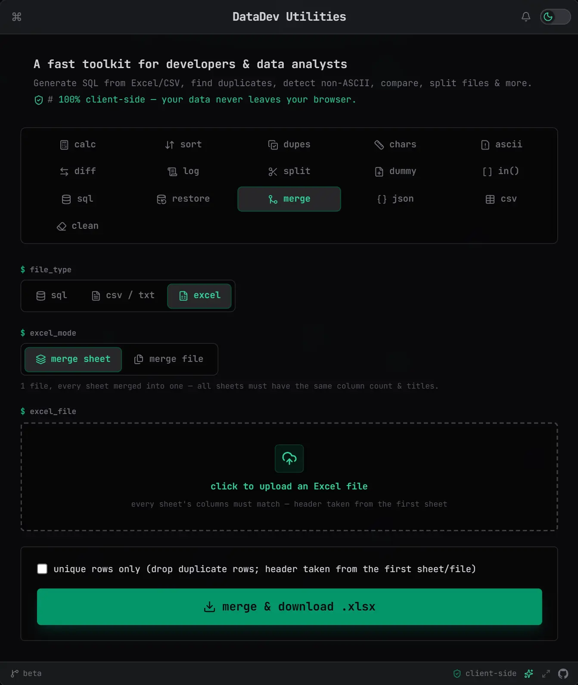

# DataDev Utilities

A lightweight, browser-based toolkit that bundles several everyday utilities for developers and data analysts into one **terminal-inspired**, fully responsive interface — no installation, no backend, everything runs client-side.

🔗 **Live demo:** [skematografi.github.io/auto-utility-tool](https://skematografi.github.io/auto-utility-tool/)

## About the Project



## Features

The app is organized into tabs, each a self-contained tool:

* **`calc`** (Calculator) — Sum a list of numbers (one per line) with live totals, item count, and one-click copy. Accepts Indonesian/European number formats: a comma is treated as the decimal separator and dots as thousands separators when a comma is present (e.g. `100,120` → `100.120`, `100.120,55` → `100120.55`); plain dot-decimals like `120.55` are unchanged. Any line containing `+`, `-`, `*`, or `/` (other than a leading negative sign) is evaluated as a formula with operator precedence and added to the total (e.g. `1*5` + `5` → `10`; `10-5` + `10/2` + `5` → `15`).
* **`dupes`** (Duplicates) — Detect duplicate entries in a list and show how many times each appears, with three copy options: **copy dupes** (only the duplicated values), **copy unique** (every value de-duplicated, one each), and **copy non-dupes** (only values that appear exactly once).
* **`ascii`** (Non-ASCII) — Detect and highlight non-ASCII / hidden Unicode characters, list their code points, and copy a cleaned (ASCII-only) version of the text. Also accepts an Excel/CSV upload and scans it **by row** — reporting only the rows/cells that actually contain non-ASCII characters (with their location and code points), or a "file is clean" message when there are none.
* **`diff`** (Compare) — Compare two blocks of text line-by-line and highlight the differences between them. Export the result via a dropdown: **all** downloads a 6-sheet `.xlsx` (matched/unmatched for left, right, and combined between both sides), or pick a single category to download just that list as `.txt`.
* **`sql`** (SQL Generator) — Generate SQL from an uploaded Excel / CSV file:
  * Upload `.xlsx`, `.xls`, or `.csv` and preview the detected columns.
  * **Delete** — build `DELETE ... WHERE col IN (...)` with automatic per-column de-duplication, from one or more conditions.
  * **Update** — build `UPDATE ... SET ... WHERE ...`, grouping rows with identical `SET` values into a single `IN (...)` statement where possible.
  * **Template** — write any SQL with `{ColumnName}` / `{1}` placeholders and it is filled once per row — for complex cases the structured modes can't express (e.g. updating a detail table via a join).
  * Smart quoting: numbers stay unquoted; strings containing a single quote are wrapped in double quotes (and vice versa).
  * Date / datetime columns are auto-detected (Excel date-formatted cells, or plain-text values in common formats) and normalized to `Y-m-d` / `Y-m-d H:i:s` in the output.
  * CSV falls back to a lenient delimiter split when a whole line is wrapped in one outer quote pair (e.g. `"col1|col2|..."`), a pattern some exports produce that would otherwise read as a single column.
  * The result is previewed and downloaded directly as a `.sql` file.
* **`log`** (Log Viewer) — Upload or paste an application log and read it as a searchable table (time, level, user, IP, category, message):
  * Understands the common `2026-07-25 11:06:39 [ip][user][session][level][category] message` layout, and keeps multi-line dumps (e.g. `$_POST = [ … ]`) attached to their entry.
  * Full-text search across every column with match highlighting, plus a level filter and per-level counts.
  * The message column is a **show detail** button — click it to open the full message in a centered, scrollable dialog (with copy, `Esc` to close), search matches highlighted inside.
  * Results are paged (50/100/250 per page) so large files stay responsive.
* **`split`** (Split File) — Split an uploaded Excel / CSV into multiple files, downloaded together as a `.zip`:
  * Set the max rows per file — the number of output files is calculated automatically.
  * Optionally pick a column so rows sharing the same value stay in the same file; leave it empty to split purely by row count.
  * Each output file keeps the header row and matches the uploaded format (`.csv` → CSV, Excel → `.xlsx`).
* **`dummy`** (Dummy File) — Generate a blank file of a given type and size, for testing uploads and size limits (max 100 MB):
  * Supported formats: `xlsx`, `docx`, `pdf`, `csv`, `txt`, `json`, `xml`, `jpg`, `png`, `gif` — or enter any custom extension.
  * Set the target size in KB or MB, and optionally a file name.
  * Each file stays valid for its format: padding is placed where the format allows ignorable data (a PNG text chunk, JPEG/GIF comment blocks, a PDF content stream, or a spreadsheet cell / document paragraph) instead of being blindly appended — so images, PDFs, and Office documents all still open.
  * A custom extension that matches a supported format (e.g. `pdf`, `jpeg`, `docx`) produces a real file of that format; anything else produces a blank text file, and the status line says so.
  * Sizes are byte-exact, except where a format has a larger minimum structure (e.g. an `.xlsx` cannot go below ~16 KB).
* **`in()`** (WHERE IN Generator) — Paste a list (one item per line) and get values ready to drop into a SQL `WHERE col IN (...)` clause:
  * Auto-detects the list type: if every line is numeric (integer or decimal, e.g. `500.0000`) you get **two** outputs (unquoted numbers and quoted strings); otherwise only the quoted string output is shown.
  * Decimal values are tidied without changing their value (`500.0000` → `500`, `3.5000` → `3.5`) so the unquoted output matches integer columns for faster queries.
  * Single quotes inside string values are escaped (`'` → `''`) so the output runs safely in SQL; double quotes need no escaping.
  * Optional query template: write any SQL with a `{values}` placeholder (e.g. `... WHERE productId IN ({values});`) to get complete statements instead of a bare list.
  * Two copy buttons per output — **copy** (all values as one list/statement) and **copy chunked** (split into groups of at most 500 values per `IN`; with a template each chunk becomes its own statement, otherwise each is labelled with a `-- chunk n/N` header).
  * When the list exceeds 1000 items the chunked version is shown in the output box by default.
  * Output lines wrap at 200 characters, breaking to a new line after a comma.
* **`chars`** (Character Count) — Paste any text and get live counts plus database storage estimates:
  * Total characters (counted per Unicode code point, so emoji count as 1), lines, words, sentences, paragraphs, and spaces.
  * **`size_utf8`** — actual UTF-8 byte size, matching storage in MySQL `utf8mb4` (VARCHAR / TEXT) and PostgreSQL.
  * **`size_utf16`** — 2 bytes per character, matching SQL Server `NVARCHAR`.
  * Sizes are shown human-readable (B / KB / MB / GB) with the exact byte count below; per-row overhead is not included.
* **`restore`** (JSON → SQL) — Paste JSON (a single object or an array of records) and generate `INSERT ... SELECT` statements to restore the data:
  * **Head** — by default, all root fields that are not arrays go into one head table (you provide its name); optionally set a head source key instead (e.g. `head`) to pull head columns from a named nested object — for JSON shaped like `{ head: {...}, detail: [...] }`.
  * **Detail** — map one or more array keys (e.g. `Details`) to their own tables; each array element becomes a `select ... union all` row.
  * Dates are normalized (`...T00:00:00...` → `YYYY-MM-DD`, otherwise `YYYY-MM-DD HH:MM:SS`); `null` stays `null`; single quotes are escaped (`'` → `''`).
  * Two output styles: with column names it emits `INSERT INTO t (cols) VALUES (...), (...)` (columns camelCase, any `...ID` stays capital, e.g. `branchID`); without, it emits `INSERT INTO t SELECT ... UNION ALL SELECT ...`. Optionally null-out the identity `ID` column for a clean restore.
  * Output can be copied or downloaded as a `.sql` file.
* **`sort`** (Sort) — Paste a list or sentence (e.g. `52,91,4,5,11`) and instantly get it sorted **ascending** and **descending**, both copyable. The separator is configurable (default `,`) and newlines are always accepted. Sorting is natural / numeric-aware, so `1,10,2,5` becomes `1,2,5,10` (not lexicographic).
* **`merge`** (Merge SQL) — Upload multiple `.sql` files and combine them into a single `.sql` (downloaded, merged in the order selected):
  * Optional **clear SQL comments** — strips `--`, `#`, and `/* */` comments while preserving string literals.
  * A **boundary comment** is inserted before each file (default: the filename); use `{filename}` as a placeholder to customize it.
* **`json`** (JSON Formatter) — Paste any JSON and it formats live, no button required:
  * **code** — pretty-printed, 2-space-indented JSON.
  * **tree** — an expandable/collapsible tree (native `<details>`, no extra JS needed to toggle), with string/number/boolean/null values color-coded.
  * Shows a `valid` / `invalid` status badge and the total key count, and surfaces the parser's exact error message on invalid input.
  * `copy` grabs the pretty-printed JSON regardless of which view is active.
* **`csv`** (CSV Viewer) — Paste delimited text or upload a `.csv` file and browse it as a spreadsheet-style table, processed live:
  * The first row is always treated as the header; RFC4180-style quoted fields (embedded delimiter, quotes, newlines) always work.
  * **Delimiter** is configurable — comma, semicolon, pipe, tab, or any single custom character.
  * **Filter** — a search box matches across every column, plus a per-column filter box in the header row (Excel-style, all active filters combine); results are paginated (50/100/250 per page) so large files stay responsive.
  * Bordered cells, row numbers, and a sticky header keep it readable like a spreadsheet.
  * `copy filtered` copies the currently filtered rows (with header) back out as delimited text.
* **`clean`** (Clean Text) — Paste any text, SQL, or list and tidy its whitespace live, no button required:
  * **remove blank lines** — drops any line that is empty or whitespace-only (on by default).
  * **trim trailing whitespace** — strips trailing spaces/tabs from every line (on by default).
  * **trim leading whitespace / indentation** — strips leading spaces/tabs (off by default, so intentional code/SQL indentation is preserved unless you ask for it).
  * **collapse repeated spaces** — squashes runs of 2+ spaces down to one (off by default).
  * A `lines: X → Y` badge and a `removed:` count show the effect at a glance; not tied to any single format — works for SQL, plain text, or pasted lists alike.

### Sticky note

Alongside the tabs there is a **sticky note** panel — a scratchpad for parking values while you move between tools (a total from `calc` into `in()`, a column spotted in `log` into `sql`), since the clipboard only holds one item at a time.

It is hidden by default and opens from the floating button in the bottom-right corner. The content is saved automatically in your browser (`localStorage`), so it survives tab switches and reloads, and never leaves your device. On wide screens the panel slides in beside the card without covering it; on narrower screens it overlays the page.

### Photo reference

A matching panel on the **left** side — opened from the floating button in the bottom-left corner — styled as an Instagram-story-style viewer for pinning up to **10** images in view while you work (screenshots, diagrams, an ERD). Each photo keeps its original aspect ratio (never cropped or stretched) and is shown Polaroid/instax-print style: a white border around it, thicker along the bottom. Attach photos by clicking, dragging files onto the panel, or pasting from the clipboard (`Ctrl+V`) — all three accept multiple at once. With more than one photo they auto-shuffle randomly every 5 seconds (pausing while you hover), with a story-style progress bar up top and left/right tap zones for manual navigation; remove the current photo, add more, or clear all from the overlay controls. Unlike the sticky note, none of this is **saved anywhere**: everything lives only in memory for the current page session and disappears on reload.

### Command palette

Press **Ctrl+K** (or **Cmd+K** on macOS), or click the `⌘` icon in the title bar, to open a searchable command palette: type to fuzzy-filter and jump straight to any of the tabs above, or run a quick action (toggle theme, toggle the background animation, toggle the sticky note) without touching the mouse. Navigate with the arrow keys, confirm with **Enter**, dismiss with **Esc** or a click outside.

One palette-only action, **usage time**, has no button anywhere else: it opens a popup listing how long you've actively used each tab today (`5 m 12 s`, `1 H 5 m 12 s`, …). Time only counts while this browser tab is visible, focused, and you're not idle for 60 seconds; it resets automatically at midnight on your device.

### Focus mode

For screen-sharing or demos, click the maximize icon in the footer (or run `toggle focus mode` from the command palette) to hide the hero text, the tab grid, and the floating sticky-note / command-palette buttons — leaving just the title bar and the active tool. Switching tabs still works via **Ctrl+K**. Off by default; the toggle itself always stays visible so you can turn it back off.

### What's new

A bell icon next to the theme switch in the title bar shows a red dot whenever `CHANGELOG.md` has an entry from the last 7 days. Click it to open a popup listing the 10 most recent updates, each with its date, a "days ago" hint, and a plain-English description of what changed. If the app is opened straight from disk (`file://`) rather than a server, the popup explains that updates can't be loaded from there instead of failing silently.

## Run Locally

Clone this repository:

```bash
git clone https://github.com/Skematografi/auto-utility-tool.git
```

Then simply open `index.html` in your browser — no installation or setup required.
